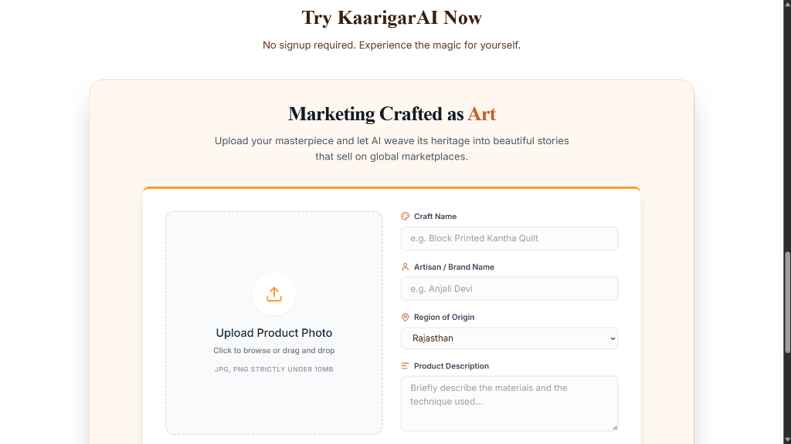
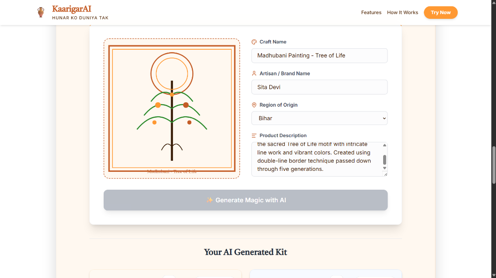
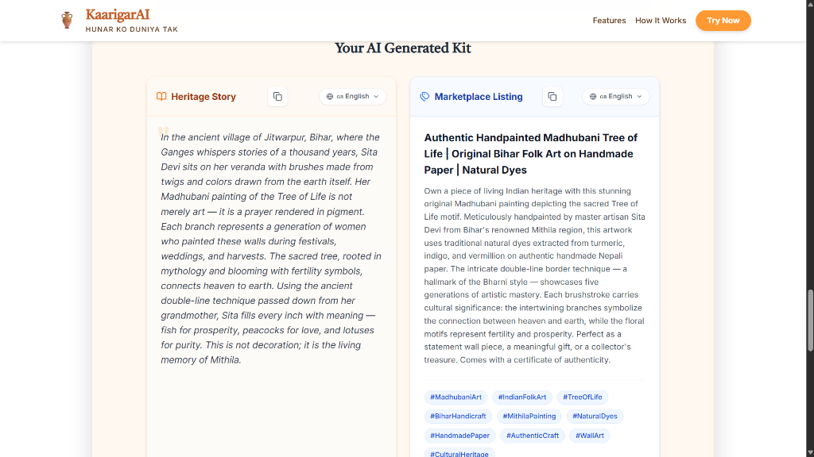
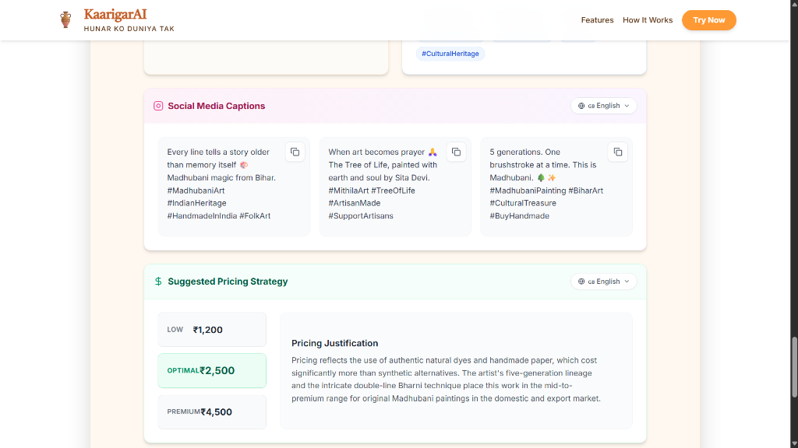
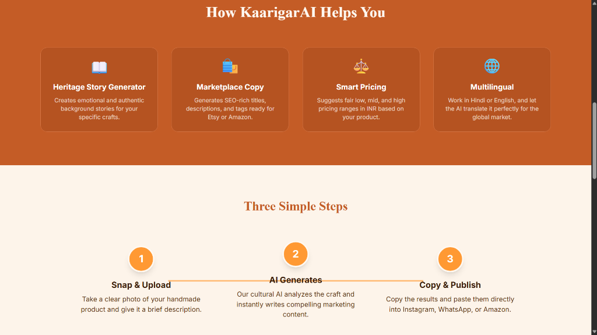
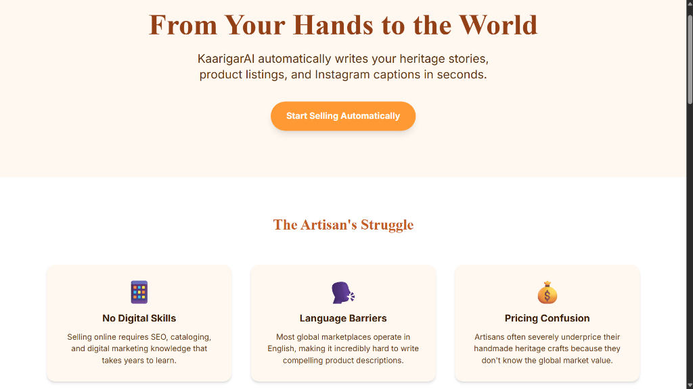

# 🏺 KaarigarAI

**KaarigarAI** is an AI-powered marketplace assistant built to empower Indian artisans. It breaks down digital barriers by converting simple product photos into robust, SEO-ready marketplace listings, heritage stories, social media captions, and data-driven pricing strategies.

Designed for accessibility, KaarigarAI works across languages (English, Hindi, Tamil & Bengali) and integrates directly via WhatsApp, ensuring artisans in the most rural communities can reach global markets without needing complex software skills.

---

## ✨ Key Features

- **Heritage Story Generator**: Automatically crafts authentic, culturally accurate background stories for the artisan's specific craft (e.g., Kantha, Madhubani).
- **Marketplace Listing Creator**: Generates SEO-optimized titles, product descriptions, and keywords ready for Etsy, Amazon, or Shopify.
- **Smart Appraisals (Pricing)**: Calculates a data-driven low, optimal, and premium price range in INR based on the uploaded product image.
- **Social Media Assistant**: Creates multiple ready-to-use Instagram captions with relevant hashtags.
- **Multi-Language Toggle**: Translate any output card to Hindi, Tamil, or Bengali with one click.
- **WhatsApp Webhook**: Artisans can text a photo and a brief voice note to our Twilio bot to receive translated listings instantly.
- **Demo Mode**: Try the full platform instantly with a Madhubani painting demo — no API key needed.
- **Pitch Deck Mode**: Built-in React component for presenting the project at hackathons (`/pitch`).

---

## 🖼 Screenshots

### Hero & Problem Statement


### Features & How It Works


### Try KaarigarAI — Generator Form


### Upload & Generate (Demo Mode)


### AI Generated Kit — Heritage Story & Marketplace Listing


### Social Media Captions & Smart Pricing


### Solution Overview


### The Problem We Solve


### Demo Preview


---

## 🛠 Tech Stack
- **Frontend**: React, Vite, Tailwind CSS (Custom earthy palette: Saffron, Terracotta, Cream).
- **Backend**: Node.js, Express.
- **AI/ML**: Google Gemini 1.5 Pro Multimodal API (Vision & Text).
- **Language**: Google Cloud Translation API + Gemini Translation.
- **Communication**: Twilio WhatsApp API.

---

## 🚀 Getting Started

To run this project locally, you will need Node.js installed. Note that to run the WhatsApp integration, you will require Twilio and ngrok.

### 1. Clone the repository
```bash
git clone https://github.com/nmnroy/KaarigarAI.git
cd KaarigarAI
```

### 2. Setup the Frontend
```bash
cd frontend
npm install

# Create a .env file:
# VITE_GEMINI_API_KEY=your_gemini_api_key

npm run dev
```
*Your frontend will be live at `http://localhost:5173`.*

### 3. Setup the Backend (Optional — for WhatsApp)
```bash
cd backend
npm install

# Create a .env file:
# PORT=5000
# GEMINI_API_KEY=your_gemini_api_key
# TWILIO_ACCOUNT_SID=your_twilio_sid
# TWILIO_AUTH_TOKEN=your_twilio_auth_token

npm run dev
```
*Your backend will be live at `http://localhost:5000`.*

---

## 🌍 Built for Bharat
KaarigarAI was built to preserve India's immense cultural heritage while equipping local creators with next-generation AI tools. 
> *"From Your Hands to the World."* 🇮🇳
